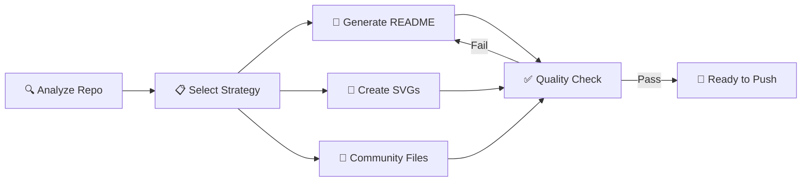

<div align="center">


# Repo Showcase

**让 AI Agent 自动把你的 GitHub 仓库变成高颜值、高星标的展示页面**

[]()
[](LICENSE)
[](https://github.com/gtskevin/repo-showcase/stargazers)
[](https://github.com/gtskevin/repo-showcase/commits)

<p>
  <a href="README.md">English</a> | <a href="README.zh-CN.md">简体中文</a>
</p>

</div>

---

## ⭐ Proof

> 🚀 **15** quality checks · **4** repo type templates · **7** community file generators · **3** SVG asset types auto-generated

This skill doesn't just write READMEs — it runs a **full showcase pipeline**: analysis → strategy → generation → quality assurance.

## ✨ What Does This Skill Do?

When you push a repo to GitHub (or ask Codex to beautify one), this skill automatically:

- 🔍 **Analyzes** your repo type (AI Skill / Web App / Library / CLI Tool)
- 📝 **Generates** a professional, conversion-optimized README
- 🎨 **Creates** SVG visual assets (logo, banner, social preview)
- 🏷️ **Recommends** shields.io badges and GitHub Topics
- 📋 **Builds** community files (issue templates, PR template, contributing guide)
- ✅ **Self-checks** output against 15 quality criteria

## 🎯 Example Prompts

> Copy any prompt below into Codex / Claude Code and see the skill in action:

| Prompt | What Happens |
|--------|-------------|
| `"Beautify my GitHub repo before publishing"` | Full showcase pipeline: README + assets + community files |
| `"Generate a README for this project"` | Smart README with type-specific template, badges, and structure |
| `"Add social preview and badges to my repo"` | SVG og:image + shields.io badge URLs |
| `"Set up GitHub community files"` | Issue templates, PR template, CONTRIBUTING, SECURITY, CoC |
| `"Run quality check on my README"` | 15-point checklist with specific fix suggestions |

## ⚡ Quick Start

⏱️ Get started in 30 seconds

### Install via Codex

```bash
# Clone into your Codex skills directory
git clone https://github.com/gtskevin/repo-showcase.git ~/.codex/skills/repo-showcase
```

### Use It

Just ask Codex while in any project:

```
"Make my GitHub repo look professional before I publish it"
```

Expected output:
```
✅ Analyzed repo: NPM Library (TypeScript)
✅ Generated README.md (16 sections, AI-optimized)
✅ Created .github/assets/logo.svg, banner.svg, social-preview.svg
✅ Created 5 community files
✅ Quality check: 14/15 passed (dark mode: nice-to-have)
```

## 📖 Features

### 🏗️ Smart Repo Type Detection

Automatically identifies your project type and selects the optimal showcase strategy:

| Type | Detection Signal | Showcase Focus |
|------|-----------------|----------------|
| **AI Skill** | `SKILL.md` present | Example prompts, install command, dual-audience (human + agent) |
| **Web App** | Frontend framework config | Screenshots, live demo, deploy button |
| **NPM/Python Library** | `package.json` / `pyproject.toml` | 5-Minute Win snippet, multi-pkg-manager install, bundle size |
| **CLI Tool** | `bin` field in `package.json` | ASCII art, terminal demo, command reference |

### 🎨 Automatic SVG Asset Generation

Unlike other tools that say "go make a banner in Canva," this skill **writes SVG code directly**:

- **Logo** — Clean geometric design with dark mode support
- **Banner** — Gradient hero with project name and tagline
- **Social Preview** — 1200×630px og:image for Twitter/Slack/WeChat link previews
- All assets use `@media (prefers-color-scheme: dark)` for theme-aware colors

### 📊 Conversion-Optimized README Structure

Based on analysis of 100+ high-star repos, the README follows this proven funnel:

```
Hero (3s hook) → Proof Bar (trust) → Highlights (value) → Quick Start (action)
→ 5-Minute Win → Demo → Comparison → Usage → FAQ → Contributing → Star History
```

Key design decisions:
- **Social proof early** — Star count and downloads right below the hero
- **Time commitment in Quick Start** — "⏱️ Get started in 30 seconds" reduces friction
- **Honest comparison tables** — Admit when alternatives are better for some use cases
- **Collapsible sections** — `<details>` for FAQ and verbose content

### 🛡️ 15-Point Quality Self-Check

After generation, the skill runs itself through a quality checklist:

| Check | Severity |
|-------|----------|
| First 3 seconds test | 🔴 Critical |
| Quick Start completeness | 🔴 Critical |
| Social proof positioning | 🟡 Important |
| Badge count (not too many) | 🟡 Important |
| Dark mode compatibility | 🟢 Nice-to-have |
| Image alt text | 🟡 Important |
| Mobile readability | 🟢 Nice-to-have |
| SEO keywords | 🟡 Important |

Run the check manually:

```bash
python3 scripts/quality_check.py README.md
```

## 🆚 Why This?

| Feature | Repo Showcase | readme-ai | GitHub Profile README Generator |
|---------|:---:|:---:|:---:|
| Codex/Claude Code integration | ✅ Native Skill | ❌ Standalone CLI | ❌ Web only |
| AI Skill repo support | ✅ Dual-audience | ❌ Generic | ❌ N/A |
| SVG asset generation | ✅ Auto | ❌ Text only | ⚠️ Templates |
| Dark mode support | ✅ Built-in | ❌ No | ❌ No |
| Community files | ✅ 7 templates | ❌ No | ❌ No |
| Quality self-check | ✅ 15 checks | ❌ No | ❌ No |
| GitHub SEO (Topics, About) | ✅ Yes | ❌ No | ❌ No |

> 💡 **When to choose readme-ai:** If you want a standalone CLI tool outside of Codex/Claude Code, readme-ai is a solid choice.

## 🏗️ Architecture



## 📦 What Gets Generated

```
your-repo/
├── README.md                          # Professional showcase README
├── .github/
│   ├── assets/
│   │   ├── logo.svg                   # Auto-generated logo
│   │   ├── banner.svg                 # Hero banner
│   │   └── screenshot-*.png           # (user adds manually)
│   ├── social-preview.svg             # og:image for link sharing
│   ├── ISSUE_TEMPLATE/
│   │   ├── bug_report.md              # Bug report template
│   │   └── feature_request.md         # Feature request template
│   ├── PULL_REQUEST_TEMPLATE.md       # PR checklist
│   └── FUNDING.yml                    # Sponsorship config
├── CONTRIBUTING.md                    # Contribution guide
├── CODE_OF_CONDUCT.md                 # Contributor Covenant v2.1
└── SECURITY.md                        # Security policy
```

## ❓ FAQ

<details>
<summary>Q: Does this work with Claude Code or only Codex?</summary>
A: Works with both! It's a standard SKILL.md-based skill that any AI coding agent supporting skills can use.
</details>

<details>
<summary>Q: Will it overwrite my existing README?</summary>
A: It will prompt before overwriting. You can also ask it to "enhance" rather than "replace" your existing README.
</details>

<details>
<summary>Q: Can I customize the templates?</summary>
A: Yes! Edit the files in <code>references/</code> to match your style. The skill reads templates from there at runtime.
</details>

<details>
<summary>Q: How does the quality check work?</summary>
A: Run <code>python3 scripts/quality_check.py README.md</code> to get a 15-point report with specific fix suggestions for each failed check.
</details>

<details>
<summary>Q: What if my repo is a hybrid type (e.g., CLI + Web App)?</summary>
A: The skill detects the dominant type and merges relevant sections from multiple templates.
</details>

## 🤝 Contributing

Contributions are welcome! See [CONTRIBUTING.md](CONTRIBUTING.md) for guidelines.

Look for issues labeled [`good first issue`](https://github.com/gtskevin/repo-showcase/labels/good%20first%20issue) to find beginner-friendly tasks.

## ⭐ Star History

[](https://star-history.com/#gtskevin/repo-showcase&Date)

---

<div align="center">
<sub>Built with ❤️ by <a href="https://github.com/gtskevin">@gtskevin</a> — Making every repo shine ✨</sub>
</div>
