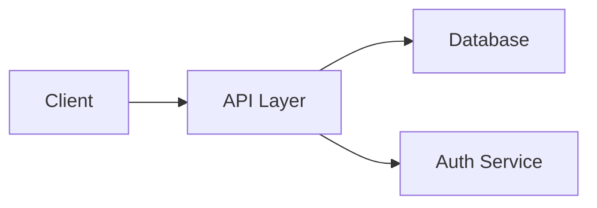

# README Templates by Repository Type

## Template: AI Skill (Codex/Claude Code)

```markdown
<div align="center">

# {Skill Name}

**{One-line benefit statement: what will this skill help your AI agent do better?}**

[]()
[]()
[]()

</div>

---

## ✨ What Does This Skill Do?

{2-3 sentences: what problem does it solve, what workflow does it improve?}

## 🎯 Example Prompts

> Copy any of these prompts and see the skill in action:

| Prompt | What Happens |
|--------|-------------|
| `"{example prompt 1}"` | {brief description of outcome} |
| `"{example prompt 2}"` | {brief description of outcome} |
| `"{example prompt 3}"` | {brief description of outcome} |

## 📦 Installation

```bash
# Install via Codex CLI
codex skill install {owner}/{repo}

# Or clone manually
git clone https://github.com/{owner}/{repo}.git ~/.codex/skills/{skill-name}
```

## ⚡ Quick Start

⏱️ Get started in 30 seconds

1. Install the skill (above)
2. Open Codex and type: `"{minimal trigger prompt}"`
3. Expected output: {describe what should happen}

## 📖 Features

{Detailed feature list with code examples}

## ❓ FAQ

<details>
<summary>Q: Which AI agents does this work with?</summary>
A: {answer}
</details>

<details>
<summary>Q: How is this different from {alternative}?</summary>
A: {honest comparison}
</details>

## 🤝 Contributing

Contributions welcome! See [CONTRIBUTING.md](CONTRIBUTING.md) for guidelines.

## ⭐ Star History

[](https://star-history.com/#{owner}/{repo}&Date)

---

<div align="center">
<sub>Built with ❤️ by <a href="https://github.com/{owner}">@{owner}</a></sub>
</div>
```

---

## Template: Web Application

```markdown
<div align="center">


# {Project Name}

**{Benefit-driven tagline — what does this app do for its users?}**

[](https://vercel.com/new/clone?repository-url={url}) []() []()

</div>

---

<div align="center">


<sub>Desktop view</sub>


<sub>Mobile view</sub>

</div>

## ✨ Highlights

- 🚀 **{Feature 1}** — {benefit}
- 🎯 **{Feature 2}** — {benefit}
- ⚡ **{Feature 3}** — {benefit}
- 🔒 **{Feature 4}** — {benefit}

## 🏃 Try It Live

[**→ Live Demo**]({demo-url}) | []({stackblitz-url})

## ⚡ Quick Start

⏱️ Get started in 60 seconds

### Prerequisites
- Node.js >= 18
- npm / yarn / pnpm

### Install & Run

```bash
# Clone the repo
git clone https://github.com/{owner}/{repo}.git
cd {repo}

# Install dependencies
pnpm install          # or: npm install / yarn

# Start development server
pnpm dev
```

Expected output:
```
  ▲ Next.js 14.2.0
  - Local:    http://localhost:3000
  - Network:  http://192.168.1.10:3000
```

> [!TIP]
> Open http://localhost:3000 in your browser to see the app running.

## 📖 Usage

{Detailed usage with code examples}

## 🏗️ Architecture



## 🆚 Why {Project Name}?

| Feature | {Project Name} | Alternative A | Alternative B |
|---------|---------------|---------------|---------------|
| {dimension} | ✅ / {data} | ✅ / {data} | ❌ / {data} |

> [!NOTE]
> **When to choose Alternative A:** If you need {specific scenario}, Alternative A is more mature.

## ❓ FAQ

<details>
<summary>Q: Can I self-host this?</summary>
A: Yes! See the <a href="docs/self-hosting.md">self-hosting guide</a>.
</details>

<details>
<summary>Q: What tech stack does this use?</summary>
A: {answer}
</details>

## 🤝 Contributing

We love contributions! Check out [CONTRIBUTING.md](CONTRIBUTING.md) to get started.

Look for issues labeled [`good first issue`](https://github.com/{owner}/{repo}/labels/good%20first%20issue) to find beginner-friendly tasks.

## ⭐ Star History

[](https://star-history.com/#{owner}/{repo}&Date)

---

<div align="center">
<sub>Built with ❤️ by <a href="https://github.com/{owner}">@{owner}</a></sub>
</div>
```

---

## Template: NPM / Python Library

```markdown
<div align="center">

# {Package Name}

**{One-line benefit: what problem does this library solve?}**

[](https://www.npmjs.com/package/{package-name})
[](https://bundlephobia.com/package/{package-name})
[](https://www.npmjs.com/package/{package-name})
[]()

</div>

## ⚡ 5-Minute Win

```typescript
// Just 3 lines to get started
import { mainFunction } from '{package-name}'

const result = mainFunction({ input: 'your data' })
console.log(result.output)
// → {show expected output}
```

## 📦 Installation

```bash
# npm
npm install {package-name}

# pnpm (recommended)
pnpm add {package-name}

# yarn
yarn add {package-name}
```

> [!NOTE]
> Requires Node.js >= 18 / Python >= 3.10

## 🎯 Highlights

- ⚡ **{Feature}** — {benefit with data if possible}
- 📦 **Tiny footprint** — {X}kB minzipped
- 🔒 **Type-safe** — Full TypeScript support
- 🧪 **Well-tested** — {X}% code coverage

## 📖 API Reference

### `mainFunction(options)`

| Parameter | Type | Default | Description |
|-----------|------|---------|-------------|
| `input` | `string` | required | {description} |
| `mode` | `'fast' \| 'accurate'` | `'fast'` | {description} |

**Returns:** `{ output: string, metadata: object }`

→ [Full API Documentation]({docs-url})

## ❓ FAQ

<details>
<summary>Q: How does this compare to {alternative}?</summary>
A: {honest answer — acknowledge when alternative is better for certain cases}
</details>

<details>
<summary>Q: Does it support {platform/framework}?</summary>
A: {answer}
</details>

## 🤝 Contributing

See [CONTRIBUTING.md](CONTRIBUTING.md). Beginner-friendly issues are tagged [`good first issue`](https://github.com/{owner}/{repo}/labels/good%20first%20issue).

## ⭐ Star History

[](https://star-history.com/#{owner}/{repo}&Date)

---

<div align="center">
<sub>Made with ❤️ by <a href="https://github.com/{owner}">@{owner}</a></sub>
</div>
```

---

## Template: CLI Tool

```markdown
<div align="center">

```
{ASCII art or figlet of tool name}
```

**{One-line benefit: what does this CLI tool do for developers?}}

[](https://www.npmjs.com/package/{tool-name})
[]()
[]()

</div>

## 🎬 Demo

```bash
$ {tool-name} --demo
{sample terminal output showing the tool in action}
```

## 📦 Installation

```bash
# macOS / Linux (Homebrew)
brew install {owner}/tap/{tool-name}

# npm (any platform)
npm install -g {tool-name}

# cargo (Rust)
cargo install {tool-name}
```

## ⚡ Quick Start

⏱️ Get started in 15 seconds

```bash
# Initialize a project
{tool-name} init

# Run the main command
{tool-name} run
```

Expected output:
```
✅ Done! Processed 42 files in 1.3s
```

## 📖 Commands

| Command | Description | Example |
|---------|-------------|---------|
| `{tool-name} init` | Initialize config | `{tool-name} init --template minimal` |
| `{tool-name} run` | Execute main action | `{tool-name} run --verbose` |
| `{tool-name} config` | Manage settings | `{tool-name} config set key value` |

## 🎯 Highlights

- ⚡ **Fast** — Process {X} files in {Y} seconds
- 🔧 **Configurable** — `.{tool-name}rc` config file support
- 🎨 **Beautiful output** — Colorful, informative terminal UI
- 🔌 **Plugin system** — Extend with custom plugins

## ❓ FAQ

<details>
<summary>Q: Does it work on Windows?</summary>
A: {answer}
</details>

<details>
<summary>Q: Can I use it in CI/CD pipelines?</summary>
A: Yes! Use the `--no-color` flag and `--format json` for machine-readable output.
</details>

## 🤝 Contributing

See [CONTRIBUTING.md](CONTRIBUTING.md).

## ⭐ Star History

[](https://star-history.com/#{owner}/{repo}&Date)

---

<div align="center">
<sub>Crafted with ❤️ by <a href="https://github.com/{owner}">@{owner}</a></sub>
</div>
```

---

## Section Inclusion Matrix

| Section | AI Skill | Web App | Library | CLI Tool |
|---------|----------|---------|---------|----------|
| Language Switcher | Optional | Optional | Optional | Optional |
| Hero | ✅ Required | ✅ Required | ✅ Required | ✅ Required |
| Proof Bar | ✅ Required | ✅ Required | ✅ Required | ✅ Required |
| Highlights | ✅ Required | ✅ Required | Recommended | ✅ Required |
| Try in Browser | N/A | ✅ Required | Recommended | Optional |
| Quick Start | ✅ Required | ✅ Required | ✅ Required | ✅ Required |
| 5-Minute Win | N/A | Optional | ✅ Required | N/A |
| Demo | Recommended | ✅ Required | Optional | Recommended |
| Why This? | Recommended | Optional | Optional | N/A |
| Usage | ✅ Required | ✅ Required | ✅ Required | ✅ Required |
| API Reference | N/A | Optional | ✅ Required | N/A |
| FAQ | Recommended | Recommended | Recommended | Recommended |
| Troubleshooting | Optional | Optional | Optional | Recommended |
| Contributing | ✅ Required | ✅ Required | ✅ Required | ✅ Required |
| Star History | ✅ Required | ✅ Required | ✅ Required | ✅ Required |
| Footer | ✅ Required | ✅ Required | ✅ Required | ✅ Required |
