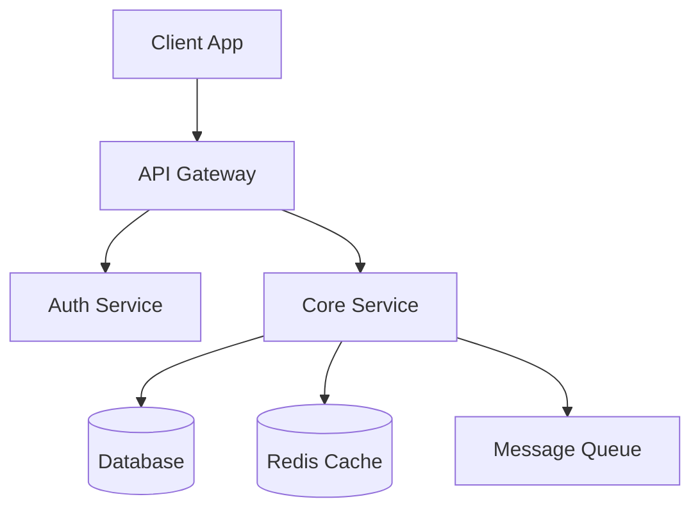
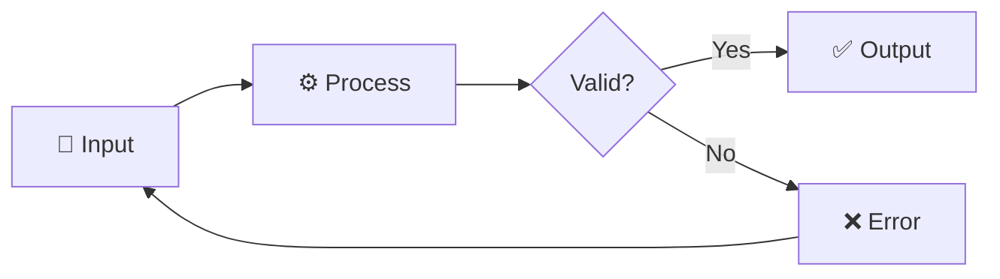
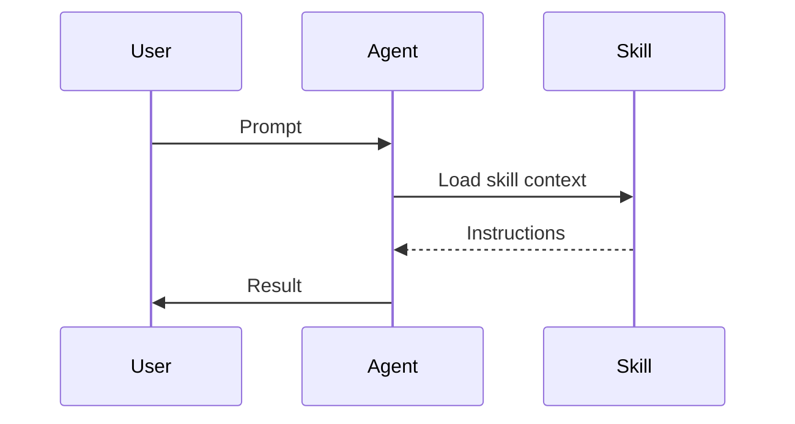

# Visual Guidelines — SVG Generation & Design Rules

## SVG Logo Generation

When a repo lacks a logo, generate a clean geometric SVG. Follow these rules:

### Design Principles
- Use simple geometric shapes (circles, rounded rectangles, triangles)
- Limit to 2-3 colors from a cohesive palette
- Ensure the logo works at 32x32px (favicon) and 120x120px (README)
- Export with transparent background
- Include dark mode variant using CSS media query

### SVG Logo Template

```svg
<svg xmlns="http://www.w3.org/2000/svg" viewBox="0 0 120 120" width="120" height="120">
  <defs>
    <style>
      @media (prefers-color-scheme: dark) {
        .bg { fill: #1a1a2e; }
        .fg { fill: #e0e0ff; }
        .accent { fill: #7c3aed; }
      }
    </style>
  </defs>
  <rect class="bg" width="120" height="120" rx="24" fill="#f8fafc"/>
  <!-- Replace with project-specific icon -->
  <text class="fg" x="60" y="70" text-anchor="middle" font-family="system-ui" font-size="48" font-weight="bold" fill="#1e293b">
    {Icon or Letter}
  </text>
</svg>
```

## SVG Banner Generation

For README hero banners (800x200px):

```svg
<svg xmlns="http://www.w3.org/2000/svg" viewBox="0 0 800 200" width="800" height="200">
  <defs>
    <style>
      @media (prefers-color-scheme: dark) {
        .banner-bg { fill: #0f172a; }
        .banner-title { fill: #f1f5f9; }
        .banner-subtitle { fill: #94a3b8; }
      }
    </style>
    <linearGradient id="bg" x1="0%" y1="0%" x2="100%" y2="100%">
      <stop offset="0%" style="stop-color:#667eea"/>
      <stop offset="100%" style="stop-color:#764ba2"/>
    </linearGradient>
  </defs>
  <rect class="banner-bg" width="800" height="200" rx="12" fill="url(#bg)"/>
  <text class="banner-title" x="400" y="95" text-anchor="middle"
        font-family="system-ui, -apple-system, sans-serif" font-size="36" font-weight="bold" fill="white">
    {Project Name}
  </text>
  <text class="banner-subtitle" x="400" y="135" text-anchor="middle"
        font-family="system-ui, -apple-system, sans-serif" font-size="18" fill="rgba(255,255,255,0.85)">
    {Tagline}
  </text>
</svg>
```

## Social Preview Image (og:image)

Generate as SVG at 1200x630px. Include:
- Project name (large)
- One-line description
- Logo (if exists)
- Key visual element or feature highlight
- GitHub stars count (if available)

Store at `.github/social-preview.svg`. GitHub will automatically use it as the social preview.

```svg
<svg xmlns="http://www.w3.org/2000/svg" viewBox="0 0 1200 630" width="1200" height="630">
  <defs>
    <style>
      @media (prefers-color-scheme: dark) {
        .social-bg { fill: #0f172a; }
        .social-title { fill: #f8fafc; }
        .social-desc { fill: #cbd5e1; }
      }
    </style>
    <linearGradient id="socialGrad" x1="0%" y1="0%" x2="100%" y2="100%">
      <stop offset="0%" style="stop-color:#4f46e5"/>
      <stop offset="100%" style="stop-color:#7c3aed"/>
    </linearGradient>
  </defs>
  <rect class="social-bg" width="1200" height="630" fill="url(#socialGrad)"/>
  <!-- Logo area (left side) -->
  <rect x="80" y="230" width="120" height="120" rx="24" fill="rgba(255,255,255,0.15)"/>
  <!-- Title -->
  <text class="social-title" x="240" y="280" font-family="system-ui" font-size="48" font-weight="bold" fill="white">
    {Project Name}
  </text>
  <!-- Description -->
  <text class="social-desc" x="240" y="330" font-family="system-ui" font-size="24" fill="rgba(255,255,255,0.8)">
    {Description — max 60 chars}
  </text>
  <!-- Bottom bar with stats -->
  <rect x="0" y="560" width="1200" height="70" fill="rgba(0,0,0,0.2)"/>
  <text x="80" y="602" font-family="system-ui" font-size="18" fill="rgba(255,255,255,0.7)">
    ⭐ {star_count} stars  ·  📦 {tech_stack}  ·  🔗 github.com/{owner}/{repo}
  </text>
</svg>
```

## Color Palette Recommendations

### For Tech/Developer Tools
- Primary: `#4f46e5` (indigo) or `#2563eb` (blue)
- Accent: `#7c3aed` (violet) or `#06b6d4` (cyan)
- Background Light: `#f8fafc`
- Background Dark: `#0f172a`

### For Creative/Design Tools
- Primary: `#ec4899` (pink) or `#f59e0b` (amber)
- Accent: `#8b5cf6` (violet)
- Gradient: warm tones

### For AI/ML Tools
- Primary: `#10b981` (emerald) or `#8b5cf6` (violet)
- Accent: `#06b6d4` (cyan)
- Gradient: tech-forward feeling

## Dark Mode Rules

1. **Always provide dark mode variants** — 30-40% of developers use dark mode
2. **Use CSS media queries in SVGs** — `@media (prefers-color-scheme: dark)`
3. **Use `<picture>` for PNG images in README:**
   ```html
   <picture>
     <source media="(prefers-color-scheme: dark)" srcset="screenshot-dark.png">
     
   </picture>
   ```
4. **Test contrast ratios** — Minimum 4.5:1 for text, 3:1 for large text
5. **Avoid pure white backgrounds** — Use `#f8fafc` (light) or `#0f172a` (dark) instead

## Mermaid Diagram Templates

### Architecture Diagram


### Data Flow


### Workflow

